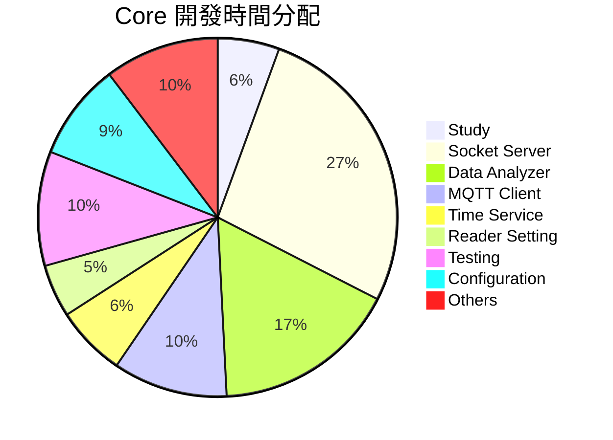
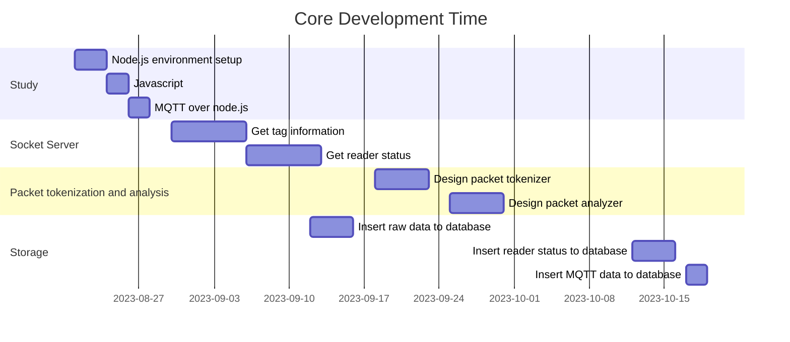

# Core 的工作內容
Core (114D -> 126D)
+ Study (7D: 08-21 ~ 08-29)
	+ Node.js environment setup
	+ Javascript
	+ MQTT over node.js
+ Realization
	+ Socket server (34D)
		+ TCP socket server (14D)
			+ Get tag information (08-30 ~ 09-07)
			+ Get reader status  (from reader -> status api) (09-08 ~ 10-11)
		+ Packet tokenization and analysis (10D)
			+ Design packet tokenizer (09-18 ~ 09-22)
			+ Design packet analyzer (09-25 ~ 10-02)
		+ Storage (10D)
			+ Insert raw data to database  (to data manage -> write api) (09-12 ~ 09-15)
			+ Insert reader status to database  (to data manage-> write api) (10-12 ~ 10-16)
			+ Insert MQTT data to database  (to data manage-> write api) (10-17 ~ 10-19)
	+ Data analyzer (Reader如果沒有比較強悍的的預處理，分析重心會放置於此，此部分的演算法會比較複雜) (17 ->21D)
		+ Analysis and Processing (14 ->18D)
			+ 設計軸(面)偵測 (10-20 ~ 10-24) 
			+ 設計準備區偵測 (10-25 ~ 10-27)
			+ 分析RSSI/Count/時間  (10-30 ~ 11-01)
			+ 讀取機台設定  (from data manage -> read api)  (11-02 ~ 11-06)
			+ 更新HMI畫面  (to hmi -> update api)  (11-07 ~ 11-09)
			+ 設計更新分析設定api  (11-10 ~ 11-14)
		+ Storage (3D)
			+ Insert 軸/架裝資料 to database  (to data manager -> write api)  
			+ Insert 準備區資料 to database  (to data manager -> write api)  
	+ MQTT client (MQTT Topic  均尚未定義，故無法評估複雜度，也並未使用過MQTT套件開發，故先保守估計) (7D ->13D)
		+ Publish data to MQTT broker  (5D: 11-15 ~ 11-21)
		+ Subscribe  (5D: 11-22 ~ 11-28)
			+ Subscribe Topic
			+ Handle received topic/data  (to ui -> machine status api)
		+ Storage  (3D: 11-29 ~ 12-01)
			+ Insert published topic/data to database  (to data manager -> write api) 
			+ Insert subscribed topic/data to database  (to data manager -> write api) 
			+ Insert HMI status to database  (to data manager -> write api)  
			+ Select report data from database  (from data manager -> read api) 
	+ Time service (8D)
		+ Sync NTP (3D)
			+ Check reader ntp  (from reader -> ntp api)  (1D: 12-07)
			+ Check HMI ntp, Make HMI sync to NTP server (1D: 12-08)
			+ 產生windows ntp sync api  (1D: 12-06 )
		+ Get system time (3D)
			+ Get reader time  (Check reader timestamp)(from reader -> ntp api)  (1D: 12-04)
			+ Get HMI time (Check HMI timestamp)  (1D: 12-05)
		+ Set timezone  (2D: 12-11 ~ ]
	+ Reader Setting (第一階段採用手動方式進行設定，完成其餘工作後，才會進行此部分，另外因為沒有相關API，所以先將預估時間往上增加兩天) (6D: 12-12 ~ 12-19)
		+ Set RF (4D ->6D)
			+ Set antenna  (to reader -> rf setting api)  
			+ Set power (to reader -> rf setting api)  
			+ Set session (to reader -> rf setting api) 
			+ Set Q-factor  (to reader -> rf setting api) 
+ Testing (13D)
	+ Socker server (5D)
	+ Test data manager api (3D)
	+ Test data analyzer (3D)
	+ Test time service (2D)
	+ Test reader setting (0D)
+ Configuration
	+ Socket Server (6D)
	+ MQTT Client (3D)
	+ Other Service (2D)

# Core 的時間規劃

| Development Item  | Estimated Development Time | Actual Development Time | Current State |
| ------------- | ------------- |------------- |------------- |
| Study | 7 | N/A (Partially Completed) |  **In Progress**  |
| Socket Server | 34 | N/A  (Send raw data to database) | **In Progress**  |
| Data Analyzer | 21 | N/A |
| MQTT Client | 13 | N/A |
| Time Service | 8 | N/A |
| Reader Setting | 6| N/A |
| Testing | 13 | N/A |
| Configuration | 11 | N/A |
| Others | 13 | N/A |
| Total | 126 | N/A |

# Core 的甘特圖

# Core的進度報告

1. The logger function has been added and is already working initially.
2. Draw socket server flowchart.
3. The received tag data can be written to the database.
4. Refactor and improve "access database" code

# Socket Server 的流程圖

![[Report/2023-08 華新麗華/Richard/Images/Socket Server.drawio.png]]