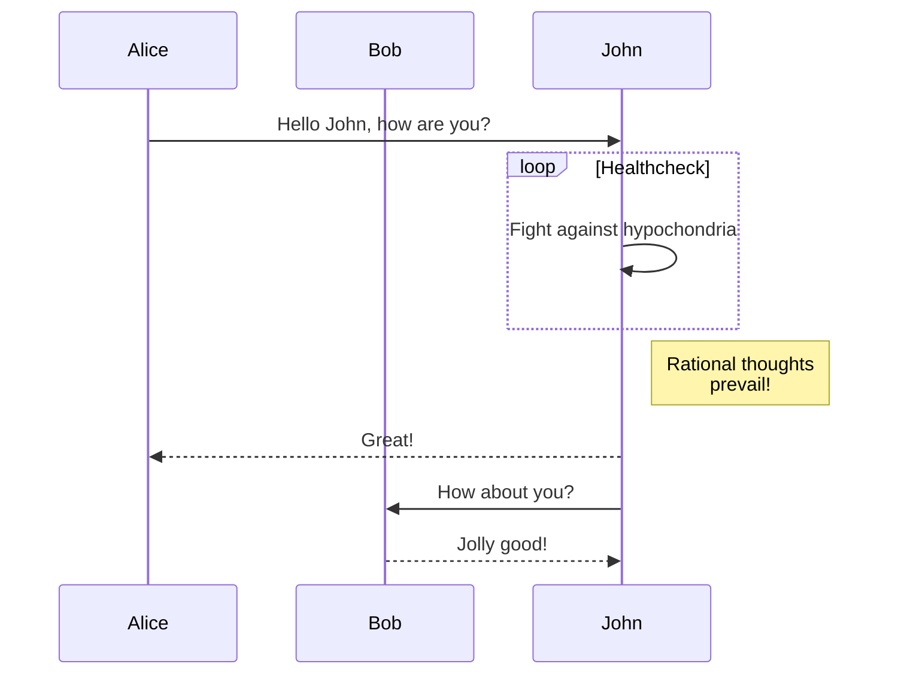
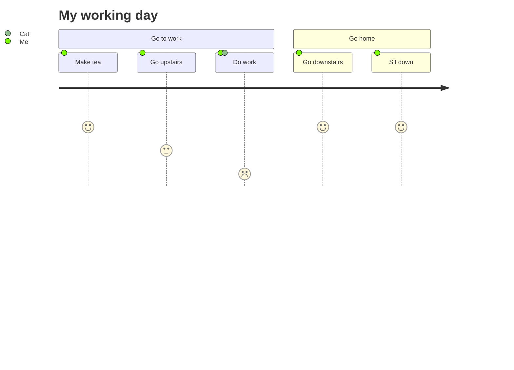
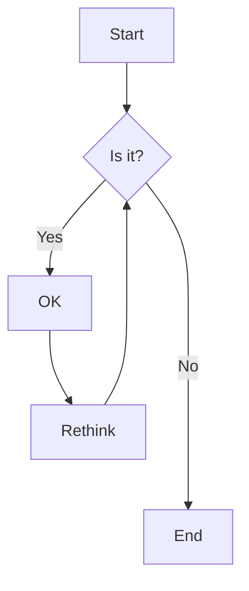
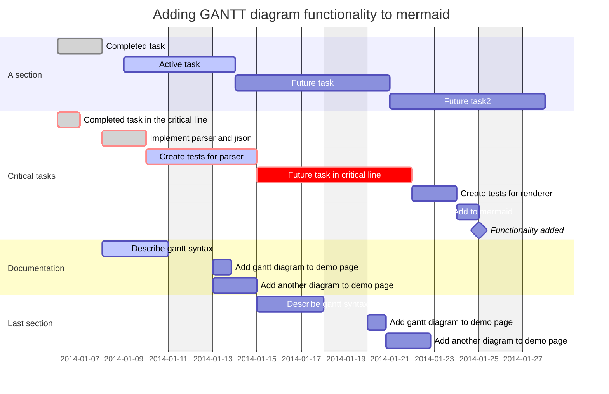

#gantt #flowchart #mermaid

Obsidian **內建支援** mermaid 作圖，只要將指令用 \`\`\` mermaid \`\`\` 包起來就好了
mermaid 的指令可以參考 [mermaid 網站](https://mermaid.js.org/intro/)
以下是抄來的範例：

## Sequence Diagram

## Journey

## Flowchart

## Gantt

其他參考：
[https://www.runoob.com/markdown/md-advance.html?tdsourcetag=s_pctim_aiomsg](https://www.runoob.com/markdown/md-advance.html?tdsourcetag=s_pctim_aiomsg)
