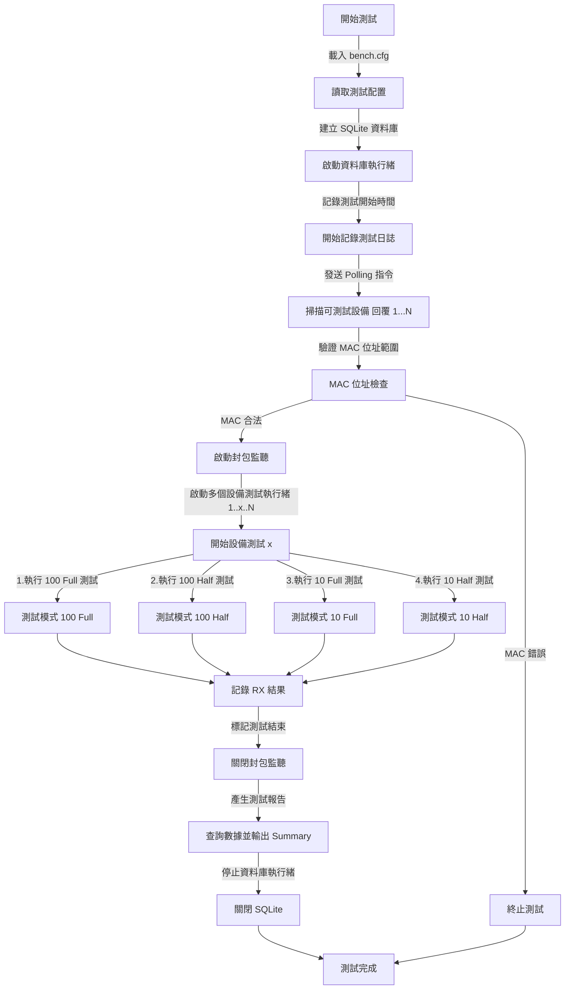

```mermaid


graph TD;
    A[開始測試] -->|載入 bench.cfg| B[讀取測試配置]
    B -->|建立 SQLite 資料庫| C[啟動資料庫執行緒]
    C -->|記錄測試開始時間| D[開始記錄測試日誌]
    
    D -->|發送 Polling 指令| E[掃描可測試設備 回覆 1...N]
    E -->|驗證 MAC 位址範圍| F[MAC 位址檢查]
    F --MAC 合法--> G[啟動封包監聽]
    F --MAC 錯誤--> X[終止測試]
    
    G -->|啟動多個設備測試執行緒 1..x..N| H[開始設備測試 x]
    
    H -->|1.執行 100 Full 測試| H1[測試模式 100 Full]
    H -->|2.執行 100 Half 測試| H2[測試模式 100 Half]
    H -->|3.執行 10 Full 測試| H3[測試模式 10 Full]
    H -->|4.執行 10 Half 測試| H4[測試模式 10 Half]

    H1 --> H5[記錄 RX 結果]
    H2 --> H5
    H3 --> H5
    H4 --> H5
    
    H5 -->|標記測試結束| I[關閉封包監聽]
    I -->|產生測試報告| J[查詢數據並輸出 Summary]
    
    J -->|停止資料庫執行緒| K[關閉 SQLite]
    K --> L[測試完成]

    X --> L
```

