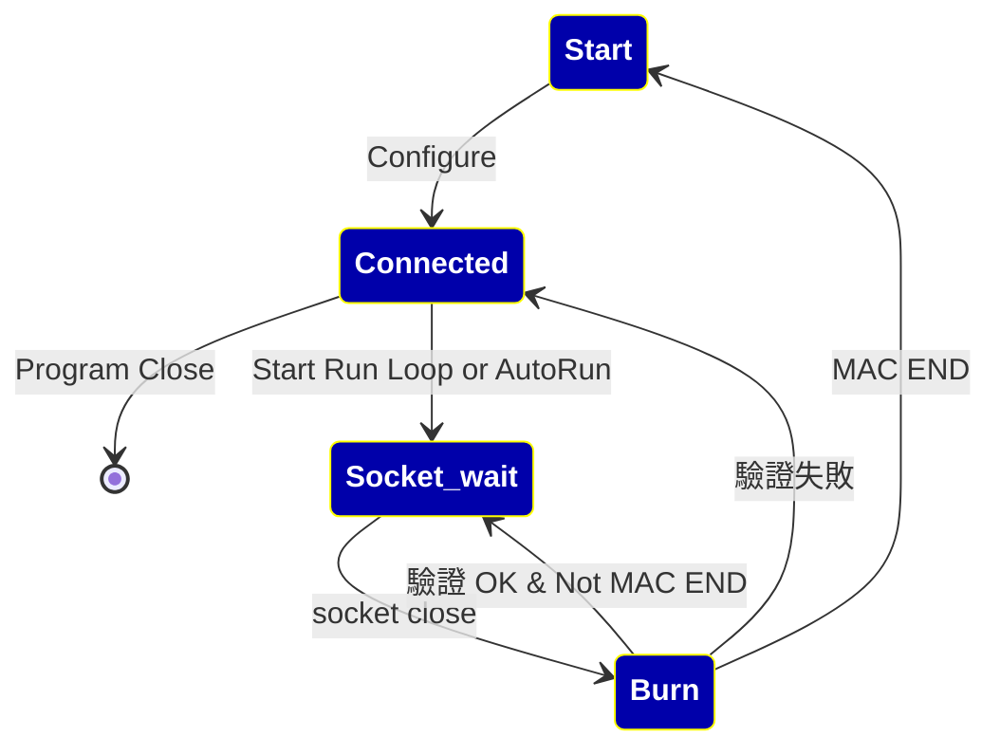

| 本文件版本 | comment                                                                |
| ----- | ---------------------------------------------------------------------- |
| 0.1.0 | 初稿                                                                     |
| 0.1.1 | Review 2024/02/27                                                      |
| 0.1.2 | 2024/03/12 新增流程章節，修改 Settings ，初稿待討論                                   |
| 0.1.3 | 2024/03/29 修改 Settings JSON 欄位，字串“N“，”Y“ 改爲 Boolean False，Boolean True |
| 0.1.4 | 2024/04/02  OverwriteNonEmptyEEPROM 移到 Template                        |
| 0.1.5 | 定義 [燒錄操作流程](#燒錄操作流程)                                                   |

# 定義
下列定義都是以 JSON format 存檔，方便使用者改寫。 
## Settings：

程式初始需要讀的設定，第一次自行 create。
欄位如下：

| Field                         | Example Value          | Initial Value                                                    |
| ----------------------------- | ---------------------- | ---------------------------------------------------------------- |
| Template Path                 | ~/my_folder/templates/ | ${HOME}/programmer/templates                                     |
| Source Template File          | DM9051A.tmpl           | ${HOME}/programmer/templates/DM9051A.tmpl (create if not exist ) |
| Profile\[1]                   | my_1.json              | profile_1.json                                                   |
| Profile\[2]                   | test_2.json            | profile_2.json                                                   |
| Profile\[3]                | ex3.json               | profile_3.json                                                   |
| Profile\[4]                   | 4.json                 | profile_4.json                                                   |
| Profile Path                  | ~/my_folder/profiles/  | get from QFileDialog, default to ${HOME}/programmer/profiles/    |
| Template Version              | 1.0.0                  | 1.0.0                                                            |
| App Version                   | 1.0.0                  | 1.0.0                                                            |
| Log Path                      | ~/my_folder/logs/      | ${HOME}/programmer/logs/                                         |
| Report Path                   | ~/my_folder/reports/   | ${HOME}/programmer/reports/                                      |
| Refresh Interval default (ms) | 1000                   | 1000                                                             |
| Status Max Size               | 1000                   | 1000                                                             |

## Template
當按下 **New Programmer** 的時候，跳出 Wizard，Wizard 根據 Template 內容對新增的 Profile 初始化，並讓 user 填寫內容。Template 欄位如下表所示。
### 出廠設定：
包括 要燒錄的 MAC Address 範圍，這個範圍由 MAC begin 到 MAC end 指定，還有 PID 、VID、Template 版號。

| Field                      | Example           | Initial Value     |
| -------------------------- | ----------------- | ----------------- |
| Begin MAC Address          | AA:BB:CC:DD:EE:00 | 00:00:00:00:00:00 |
| End MAC Address            | AA:BB:CC:DD:EE:FF | 00:00:00:00:00:00 |
| PID                        | 9051              | 9051              |
| VID                        | 0A46              | 0A46              |
| Template Version           | 1.0.0             | 1.0.0             |
| ManuFacturer               | DAVICOM           | DAVICOM           |
| StopOnFailure              | true              | true              |
| SkipFailedMAC              | false             | false             |
| Overwrite Non-Empty EEPROM | N                 | N                 |
| Chip Binary Profile        | 0A531128CBF6..... | 000000000000..... |
| Chip Binary Profile Size   | 22                | 22                |
| Template ID                | CustomerXYZ       | CustomerXYZ       |

>[!Note]
>
>Report Path：產生 Report 時存放的檔案Path
>Refresh Interval 以 millisec 爲單位，不提供使用者調整
>Template ID：識別 Template 識別字串

>[!MD5]
Template  存檔資訊附帶 MD5 ，方便確認爲原廠 Template。

## Profile
當按下 **New Programmer** 的時候，由 Wizard 引導修改，產生 profile，內容大致可以分成 Static 與 Run time。
### Static：
Copy from [Template 出廠設定](#Template)
### Run time：
在 Profile 產生的時候，給予初始值，除了 Template 的欄位之外，Runtime 欄位如下：

| Field                              | Example                            | Initial Value                           |
| ---------------------------------- | ---------------------------------- | --------------------------------------- |
| Current MAC Address                | AA:BB:CC:DD:EE:00                  | copy from `Begin MAC Address`           |
| Effective MAC Address              | AA:BB:CC:DD:EE:01                  | 00:00:00:00:00:00                       |
| Profile Number(one start)          | 1                                  | index of profile                        |
| COM Port                           | com 5                              | NULL                                    |
| Log File                           | 2024_0226_160530_com5.log          | 依照 create time 初始化, 檔名參考下面的 Note        |
| Source Template`Note2`  | ~/my_folder/templates/DM9051A.tmpl | Settings[`"Source Template File"`]      |
| Refresh Interval`Note2` | 1000                               | Settings\[`"Refresh Interval Default"`] |

>[!Note]
>Log File 每次 run 的時候，用當時時間產生一個，檔案名稱格式爲 {year}\_{month}{day}\_{hour}{min}{sec}\_{COM}.log, 例如 2024_0312_103053_COM5.log。

>Overwrite Non-Empty EEPROM 如果發生，則跳出 Dialog 詢問

> [!Note2]
> Source Template File 從 Settings 讀取
> Refresh Interval 也是從 Settings 讀取
> 從 Settings 讀到的欄位是用 Template 產生 Profile 的時候，動態附加上去，出廠的 Template 沒有這些欄位 
> Refresh Interval 以 millisec 爲單位，不提供使用者調整。
# 流程設計
## App Start
App start 時，讀取 **settings**（初始從 resource 來）， 進入 `configure settings wizard`，從 template 取得初始值，提供 user 修改 幾個 paths：
+ source template path
+ profile path
+ log path
+ report path
結束後存入 **settings** 。
App 有 `configure settings` button ，讀取 settings 的值，讓 user 重新 configure。
結果存回 **settings**

App 畫面 4 個 Tabs，初始不連上 Programmer，之後自動 connect
各自有各自的 profile

>[!Note] 在 `configure settings` 的過程，關於每個 `profile`  設定，不進行設定，
以後每個 tab 裏面提供按鈕呼叫 `configure profile wizard` 

>[!Info] 
>第一階段提供一個 tab，第二階段提供 4 個 tabs
## Tab i 頁面 （ i 是頁面 index 從 0 開始)

### Tab i Wizard

提供 `configure profile` button ，進入 `configure profile wizard` 提供 user 修改 ：
+ 讀取 settings.profile[i] 的檔案內容，給 user 修改
+ 結果存回 settings.profile[i] 的檔案
+ wizard 頁面提供下列設定：
	+ Start MAC Addr
	+ End MAC Addr
	+ PID
	+ VID
	+ Stop on error （發生錯誤是否自動 restart）
	
	
### Tab [ i ] 

顯示下列內容：
+ Device ID
+ Programmer 是否正常
+ Start MAC Addr
+ End MAC Addr
+ Current MAC Addr 
	+ 如果 profile 裏面有上一次的，就複製，否則從 Start MAC Addr 複製
+ Effective MAC Addr
+ Current Connected COM port
+ 已燒錄 MAC 數量
+ 未燒錄 MAC 數量
+ 可用 MAC 佔全部百分比 
+ 用 icon 分別表示 蓋子打開、關閉
+ configure 裏面的 Stop on error 
+ a `configure profile` button
+ button start ： 手動繼續 after error
+ polling state 依照 refresh_interval\(ms)

### 燒錄操作流程

下面列出 4 種 states：

**Table 1**  

| State       | Color on Tab | 說明                          |
| ----------- | ------------ | --------------------------- |
| Start       | Gray         | App 開始，尚未與燒錄器連線             |
| Connected   | Light Green  | 已與燒錄器連線，尚未進入 Run Loop       |
| Socket Wait | Yellow       | 進入 Run Loop，Socket 等待 IC 放置 |
| Burn        | Orange       | 燒錄中                         |

**Table 2**

| Result | Color Mark |
| ------ | ---------- |
| 燒錄驗證成功 | Green  O   |
| 燒錄驗證失敗 | Red     X  |
**Table 3**

| Result | Text or Icon |
| ------ | ------------ |
| 蓋子打開   | Open         |
| 蓋子關閉   | Close        |

>[!Warning] 燒錄驗證：每一次燒錄必須經過 讀、寫、讀 三個 commands
>第一個 command 讀，要檢查 MAC Address 是否爲 Empty？若是 Empty，才能繼續，否則用 Dialog 警告 user 該 Chip 曾經燒錄過，確認後才繼續。
>第二個 command 寫，先 reset **曾經打開蓋子** 的 flag，然後再燒錄內容
>第三個 command 讀，核對與寫入的內容是否相同
>

## Programmer Status
+ 蓋子曾經打開 Lid Ever Open
+ 蓋子目前狀態 Lid Is Opened

# Update Notes

整合 Modbus 0319_1002 版本
![[modbus_update_0319.png]]

