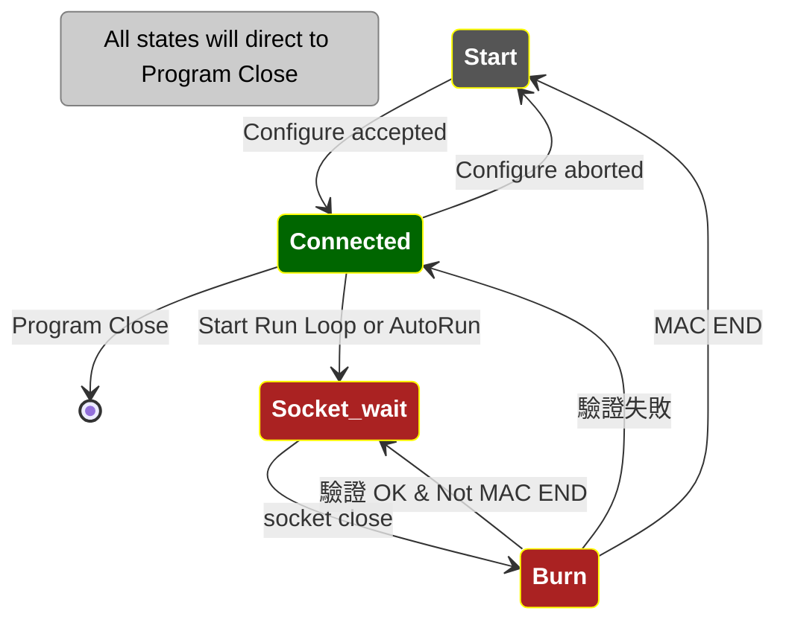

# Agenda

Qt 程式設計簡介
Qt 程式特色：Signal & Slot
Production Mode 規格
Production Mode 程式說明
Engineer Mode 程式說明

# Qt 程式設計簡介

Qt 是一個跨平台的 C++ 應用程式框架，廣泛用於開發圖形使用者界面（GUI）以及非 GUI 程式。由於其強大的功能和靈活的特性，Qt 成為許多開發者的首選工具。

## 主要特性
### 跨平台支援：
Qt 支援多種操作系統，包括 Windows、macOS、Linux、iOS 和 Android。這意味著使用 Qt 開發的應用程式可以在多種平台上運行，而無需進行大量修改。

### 模組化結構：
Qt 包含多個模組，如 QtCore、QtGui、QtWidgets 等，每個模組都提供特定的功能。這種模組化設計使得開發者可以根據需要選擇和使用不同的模組。

### 信號與槽機制：
信號與槽（Signal and Slot）是 Qt 的核心特性之一，用於對象之間的通信。這種機制使得事件處理更加靈活和簡單。

### 豐富的文檔與社區：
Qt 提供詳細的開發文檔和示例程式，並且擁有活躍的開發者社區。這些資源可以幫助開發者快速入門並解決開發中的問題。

### 常見應用場景
桌面應用：如**文本編輯器**、**媒體播放器**等。
嵌入式系統：如**工業控制**、**車載系統**等。
移動應用：支援 iOS 和 Android 平台的應用程式開發。
遊戲開發：Qt 的圖形能力也可用於遊戲開發。
簡單範例
以下是一個使用 Qt 開發的簡單 Hello World 範例：

cpp
```c++
#include <QApplication>
#include <QLabel>

int main(int argc, char *argv[])
{
    QApplication app(argc, argv);
    QLabel label("Hello, Qt!");
    label.show();
    return app.exec();
}
```

這個範例展示了如何使用 Qt 創建一個簡單的應用程式，並顯示一個包含文字 "Hello, Qt!" 的標籤。


> [! ]
> Qt 是一個功能強大且靈活的框架，適用於各種應用程式的開發。它的跨平台能力、豐富的控件庫和強大的信號與槽機制，使得 Qt 成為開發者的理想選擇。如果你正在尋找一個可靠且高效的開發工具，Qt 無疑是一個值得考慮的選擇。

# Qt 特色：Signal & Slot

Qt 的 signal 與 slot 機制是一種用於對象間通信的方式，主要用於響應用戶事件或對象狀態變化。透過 connect 函數，可以將信號（signal）與槽（slot）連接，當信號發出時，槽會被自動調用。

範例：
```c++
// 定義信號與槽
class MyWidget : public QWidget {
    Q_OBJECT
public:
    MyWidget(QWidget *parent = nullptr) : QWidget(parent) 
    {
	    // 將 QPushButton 的 clicked 信號接到我們的 onButtonClicked() 信號槽
        connect(button, &QPushButton::clicked, 
		        this, &MyWidget::onButtonClicked);
    }
private slots:
    void onButtonClicked() 
    {
        // 處理按鈕點擊事件
    }
private:
    QPushButton *button;
};
```

Signal & Slot 是 Qt 的一個重要設計，Qt 模組之間透過 signal & slot 互相溝通，方便模組化設計。
# Production Mode 規格

## Settings
這是 Application 需要的資料
範例
```json
{
    "LogPath": "/home/tom/文件/Programmer/logs",
    "LoggerLowerMegaCount": 10,
    "LoggerUpperMegaCount": 100,
    "MajorVersion": 1,
    "MinorVersion": 0,
    "PatchVersion": 0,
    "Profile": [
        "profile_1.json"
        "profile_2.json",
        "profile_3.json",
        "profile_4.json"
    ],
    "ProfileCount": 1,
    "ProfilePath": "/home/tom/文件/Programmer/profiles",
    "RefreshInterval": 500,
    "ReportPath": "/home/tom/文件/Programmer/reports",
    "SourceTemplateFile": "template.json",
    "TemplatePath": "/home/tom/文件/Programmer/templates"
}

```
## Template
這是建構 profile 的 source 設定：
範例
```json
{
    "BeginMACAddress": "00:00:00:00:00:00",
    "EndMACAddress": "00:00:00:00:00:00",
    "BinaryProfile": "000000000000000000000000000000000000000000000000",
    "BinaryProfileSize": 24,
    "MajorVersion": 1,
    "MinorVersion": 0,   
	"PatchVersion": 0,
    "OverwriteNonEmptyEEPROM": false,
    "Manufacturer": "DAVICOM",
    "SkipFailedMAC": false,
    "StopOnFailure": true,
    "TemplateID": "CustomerXYZ",
    "ProductID": "0000",
    "VendorID": "0000"
}

```
## Profile
這是每次執行一份 Production 燒錄的設定：
範例 
### profile_1 
全部從 Template copy 過來，然後根據 user 設定，新增下列欄位：
```json
{
    "COMPort": "ttyACM1",
    "CurrentMACAddress": "00:00:00:00:00:00",
    "MACAddressOnStart": "00:00:00:00:00:00",
}

```

# Production Mode 程式說明

![[Pasted image 20240709163421.png]]
## App Start
App start 時，讀取 **settings**（初始從 resource 來）。
進入 `configure profile wizard`，從 template 取得初始值，
然後程式建立幾個 paths：
#### source template path 
	default bin file 也放在 template 裏面
#### profile path 
	根據 default bin 修改爲使用者的 bin file 放在這裏
#### log path
	log 記錄、database 也放在這裏
#### report path
	產生 report 報告的地方
	
結束後存入 **settings** 。

App 畫面 4 個 Tabs，初始不連上 Programmer，之後自動 connect
各自有各自的 profile

## Configure Profile
按下 Configure Profile 按鍵後，進入 Configure Profile dialog：
![[Pasted image 20240709163508.png]]
## 燒錄操作流程

下圖 ，紅色 nodes 表示進入 **Run Loop**，在 **Run Loop** 內反覆進行 **socket 置換 IC** 的動作。



## 資料庫
程式執行的時候，建立一個資料庫，記錄執行的過程，執行一份 Production 流程 （i.e. 對應 一個 profile) 之後，就會根據 `資料庫` 的內容，彙整出一個  `Report`
#### 資料庫格式

| id  | timestamp           | tag    | message                                                                                                    |
| --- | ------------------- | ------ | ---------------------------------------------------------------------------------------------------------- |
| 815 | 2024-07-09 10:07:47 | DEBUG  | MainWindow received tabState: Tab [0], State: Burn                                                         |
| 816 | 2024-07-09 10:07:48 | INFO   | Page 0: Burn                                                                                               |
| 824 | 2024-07-09 10:07:52 | REPORT | Page 0: **REPORT END**, ID = 2024_0709_100543_ttyACM0, Profile = {"BeginMACAddress":"00:00:00:00:00:00"... |
#### Report
蒐集到 REPORT BEGIN / REPORT END 成對的記錄後，就整理爲一份 report，
範例：
```json
REPORT	Version: 1.0.0
PORT:	ttyACM1
Time:
	FROM: 2024-07-09 09:54:49
	TO:   2024-07-09 09:56:01
	Elapsed: 72 seconds
MAC Range:
	Begin: 00:00:00:00:00:00
	End:   00:00:00:00:00:0f
	Start: 00:00:00:00:00:00
Failed MAC Addresses:
	None
Summary:
	Range Count of MAC Addresses: 16
	Working Count of MAC Addresses: 16
	Failed MAC Addresses: 0
	Unfinished MAC Addresses: 0
	Success MAC Addresses: 16
	Success Ratio: 100%
```

# Engineering Mode 程式說明
當 settings 出現
```json
   { 
	   "EngineerMode": true,...
   }
```
的時候，我們切換到 **Engineering Mode**:

![[Pasted image 20240709163804.png]]
## Registers View

![[Pasted image 20240709164124.png]]


# Q & A