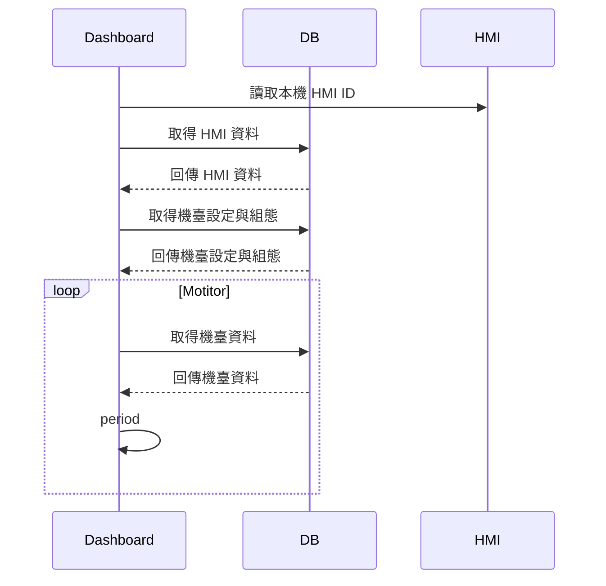
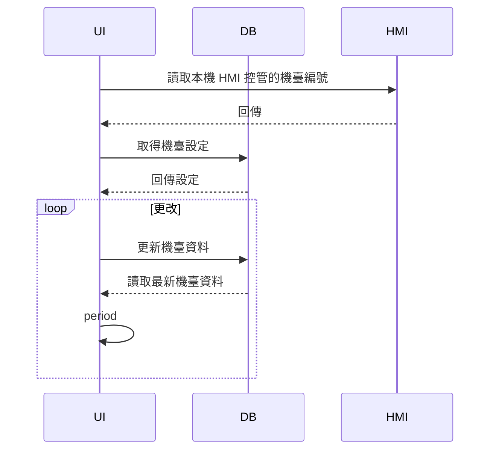
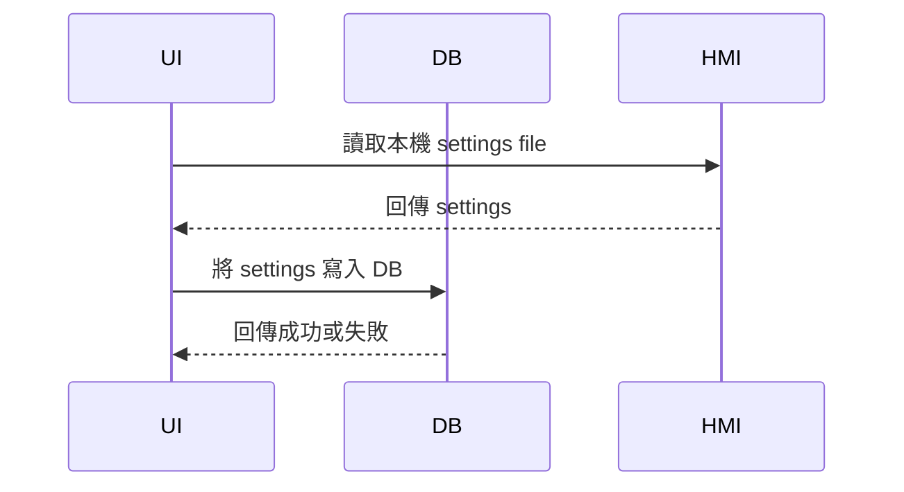
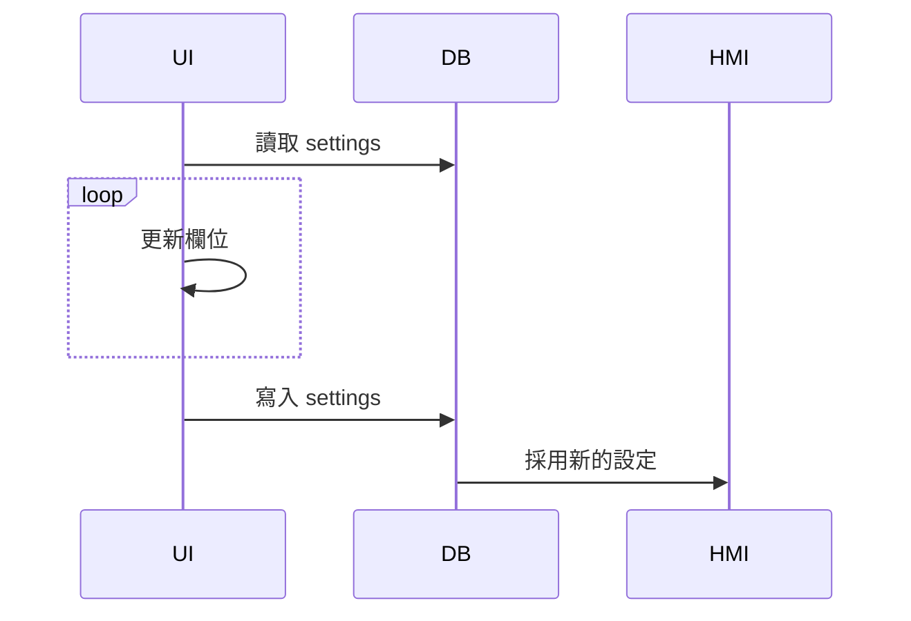
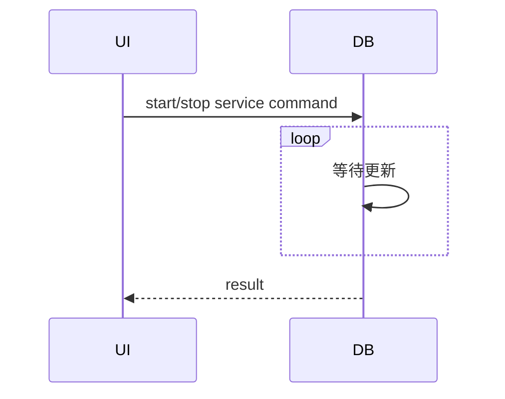

#### Dashboard




#### 機臺設定




#### 系統設定

匯入：




修改：



主控臺




#### Report
```mermaid
sequenceDiagram
  participant UI
  participant DB

  UI->> DB: get (Day/Week/Month) report
  DB-->> UI: result
  ```
