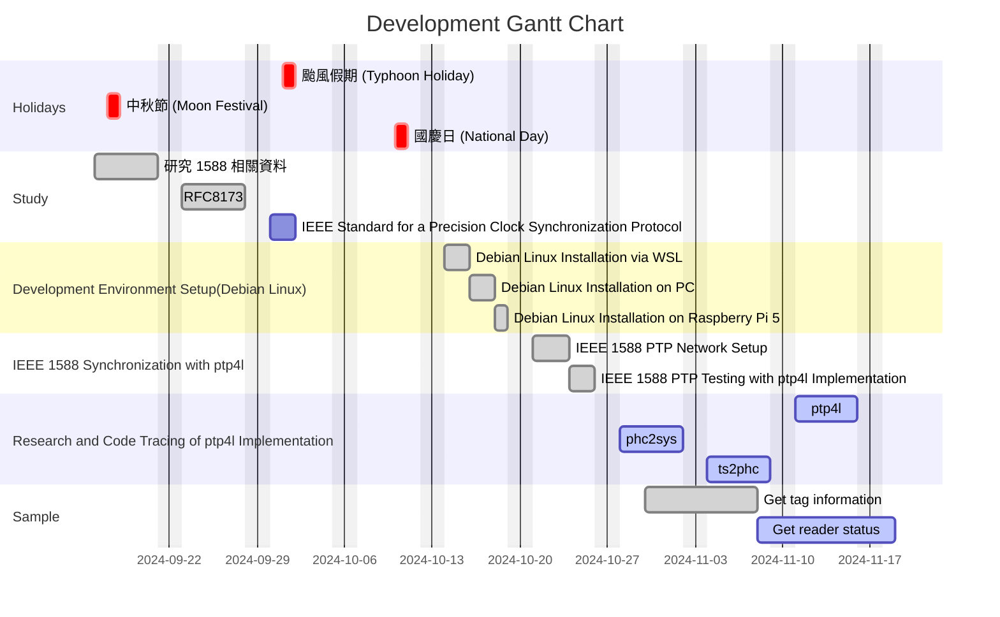
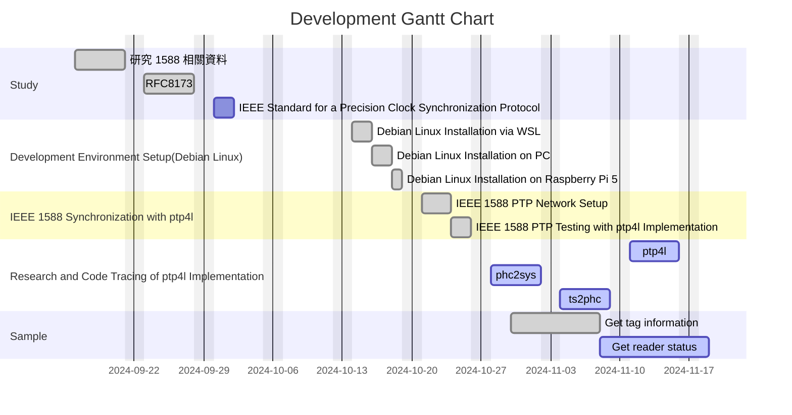
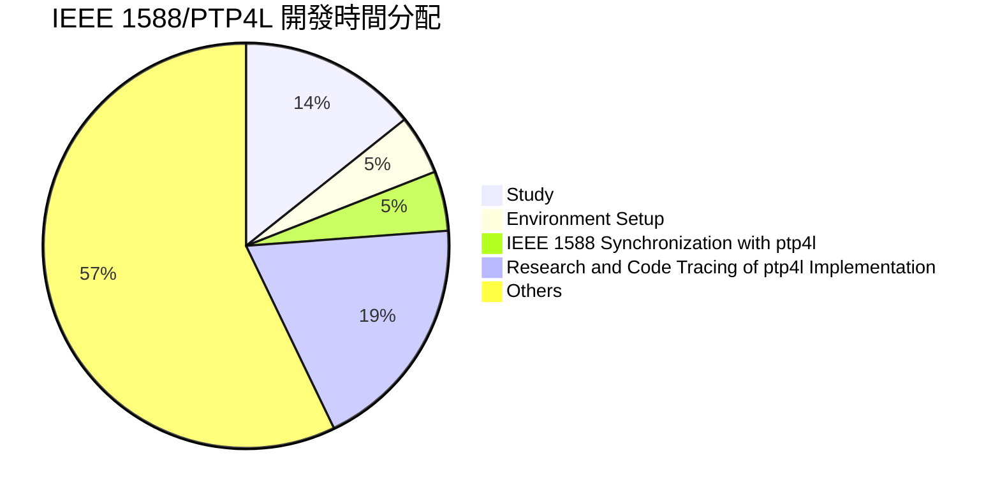

# 工作報告

IEEE 1588/PTP4L
+ Study (13D: 09-16 ~ 10-05)
	+ Research on 1588 (Completed, 5 days starting Sep 16, 2024)
	+ RFC8173 study (Completed, 5 days after previous task)
	+ IEEE Standard for a Precision Clock Synchronization Protocol Study (Completed, 2 days, following RFC8173)
	+ Others
+ Development Environment Setup
	+ Debian Linux Installation via WSL. (Completed, 2 days starting Oct 14, 2024)
	+ Debian Linux Installation on PC. (Completed, 2 days after WSL setup)
	+ Debian Linux Installation on Raspberry Pi 5. (Completed, 1 day after PC setup)
+ IEEE 1588 Synchronization with ptp4l (Completed, 5 days starting Oct 21, 2024)
	+ IEEE 1588 PTP Network Setup. (Completed, 3 days)
	+ IEEE 1588 PTP Testing with ptp4l Implementation (Completed, 2 days)
		+ Raspberry Pi 5 x 2
		+ PC x 1 and Raspberry Pi 5 x 1
		+ PC x 1 and Raspberry Pi 5 x 2
		+ PC x 1 and Raspberry Pi 5 x 2
+ Research and Code Tracing of ptp4l Implementation
	+ Download linuxptp and study (Completed, 4 days starting Oct 7, 2024)
	+ Code Tracing of linuxptp (Ongoing, starting Oct 28, 2024)
		+ ptp4l
		+ phc2sys
		+ ts2phc

## 工作進度

| 項目名稱                                              | 內容描述    | 開始時間       | 預計完成時間     | 進度  |
| ------------------------------------------------- | ------- | ---------- | ---------- | --- |
| Research and Code Tracing of ptp4l Implementation | phc2sys | 2024/10/28 | 2024/11/01 | 10% |
|                                                   |         |            |            |     |

## 預計工作項目

| Development Item                                  | Sub-Items        | Estimated Development Time | Current State                          |
| ------------------------------------------------- | ---------------- | -------------------------- | -------------------------------------- |
| Research and Code Tracing of ptp4l Implementation | phc2sys          |  5D                     | **Ongoing** |
|                                                   | ts2phc           | 5D                         |                                        |
|                                                   | ptp4l         | 5D                         |                                        |
|                                                   | Code integration | 5D                         |                                        |

## 已完成項目

| 項目名稱                                              | 內容描述                                                                                                                                                                                                      | 開始時間       | 完成時間       |
| ------------------------------------------------- | --------------------------------------------------------------------------------------------------------------------------------------------------------------------------------------------------------- | ---------- | ---------- |
| Project starts                                    | 專案開始                                                                                                                                                                                                      | 2024/09/16 |            |
| Study 1                                           | 研究 1588 相關資料                                                                                                                                                                                              | 2024/09/16 | 2024/09/20 |
| Study 2                                           | RFC8173                                                                                                                                                                                                   | 2024/09/23 | 2024/09/27 |
| Study 3                                           | IEEE Standard for a Precision Clock Synchronization Protocol                                                                                                                                              | 2024/09/30 | 2024/10/05 |
| linuxptp                                          | 研究 linuxptp 相關程式 (linuxptp v4.4) - ptp4l - phc2sys - ts2phc                                                                                                                                      | 2024/10/07 | 2024/10/11 |
| Development Environment Setup                     | 1. 透過WSL安裝Debian Linux，以及安裝Raspberry Pi 5。 2. 安裝開發環境及相關套件。 3. 透過Git下載 linuxptp 程式，並進行編譯。                                                                                                            | 2024/10/14 | 2024/10/18 |
| IEEE 1588 Synchronization with ptp4l              | 1. 使用Raspberry Pi 5兩台以及PC一台建立環境(Linux 開發平台)。 2. 三台設備均安裝開發環境及相關套件，並編譯 linuxptp 程式。 3. 執行ptp4l程式   - 針對擁有硬體的PC執行：`sudo ptp4l -i eth0 -m -l 6`   - 針對擁有硬體的PC執行：`sudo ptp4l -i enp3s0 -S -m -l 6` | 2024/10/21 | 2024/10/25 |
| Research and Code Tracing of ptp4l Implementation | Code Tracing of linuxptp - ptp4l - phc2sys - ts2phc                                                                                                                                              | 2024/10/28 |            |

### 項目甘特圖

#### Estimated Development Gantt Chart

#### Actual Development Gantt Chart

